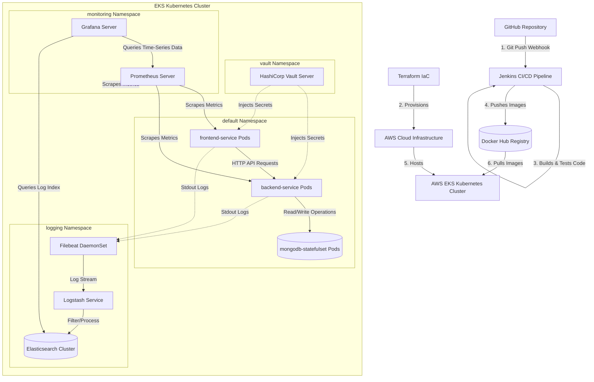

# RetailOps System Architecture Diagram
This document describes the high-level system architecture of the RetailOps platform, outlining the relationships between development repositories, CI/CD automation, cloud infrastructure, container orchestration, logging, monitoring, and security management.

---

## 1. Mermaid Architecture Diagram

The diagram below details the end-to-end integration from source control to the running microservices on AWS.



---

## 2. ASCII Architecture Diagram

```
+------------------+         1. Webhook         +-------------------------+
|                  | -------------------------> |                         |
|  GitHub Repo     |                            |   Jenkins Pipeline      |
|                  | <========================> |  (Lint, Test, Build)    |
+------------------+         IaC Edits          +-------------------------+
         |                                                   |
         | Edits                                             | 4. Push Image
         v                                                   v
+------------------+                            +-------------------------+
|  Terraform IaC   |                            |   Docker Hub Registry   |
+------------------+                            +-------------------------+
         |                                                   |
         | 2. Provision                                      | 6. Pull Image
         v                                                   v
+-------------------------------------------------------------------------+
| AWS Cloud Infrastructure (VPC, EKS, Subnets, Gateways)                 |
|                                                                         |
|  +-------------------------------------------------------------------+  |
|  | EKS Kubernetes Cluster                                            |  |
|  |                                                                   |  |
|  |  +-----------------+   HTTP Requests   +-----------------+        |  |
|  |  |  frontend Pods  | ----------------> |  backend Pods   |        |  |
|  |  +-----------------+                   +-----------------+        |  |
|  |           |                                     |                 |  |
|  |           | Scrapes                             | Reads/Writes    |  |
|  |           v                                     v                 |  |
|  |  +-----------------+                   +-----------------+        |  |
|  |  | Prometheus (Mon)|                   | MongoDB (DB)    |        |  |
|  |  +-----------------+                   +-----------------+        |  |
|  |           |                                     ^                 |  |
|  |           | Query                               | Inject Secret   |  |
|  |           v                                     |                 |  |
|  |  +-----------------+                   +-----------------+        |  |
|  |  |  Grafana (Mon)  |                   |  Vault (Sec)    |        |  |
|  |  +-----------------+                   +-----------------+        |  |
|  |           ^                                                       |  |
|  |           | Query Logs                                            |  |
|  |           +------------------------+                              |  |
|  |                                    |                              |  |
|  |  +------------+   Log Stream   +------------+   Index   +------+  |  |
|  |  | Filebeat   | -------------> | Logstash   | --------> | ES   |  |  |
|  |  +------------+                +------------+           +------+  |  |
|  |                                                                   |  |
|  |-------------------------------------------------------------------|  |
+-------------------------------------------------------------------------+
```

---

## 3. Component Explanations

1. **GitHub Repository**: Stores codebase files, including source code (frontend, backend), deployment declarations (Terraform files, Kubernetes manifests), CI configs (`Jenkinsfile`), and observability settings.
2. **Jenkins CI/CD Pipeline**: Triggers on code changes, running linters, unit tests, compiling Docker images, scanning configurations, and applying manifests to the Kubernetes cluster.
3. **Docker Hub**: Acts as the centralized artifact registry, versioning and distributing verified application images.
4. **Terraform**: Manages cloud infrastructure using IaC rules. It provisions EKS cluster network settings, nodes, and routing tables on AWS.
5. **AWS Infrastructure**: The hosting cloud fabric, composed of isolated network nodes, databases, gateways, and virtual machines.
6. **Kubernetes Cluster (EKS)**: Manages container life cycles, routing traffic, scale, updates, and cluster-state health checks.
7. **Frontend**: A React/Vite-based application served using Nginx web servers, acting as the user storefront.
8. **Backend**: A Node.js and Express API server handling transactions, cart updates, authentication, and database calls.
9. **MongoDB StatefulSet**: A stable database platform storing transaction records, inventory, and users with persistent disk volumes.
10. **HashiCorp Vault**: Handles secret token storage, auth engines, dynamic DB credentials, and runtime encryption.
11. **Prometheus**: Collects metric data via a pull model, indexing hardware, software, and latency measurements.
12. **Grafana**: Aggregates metric data sources, rendering charts, system utilization lines, and pod state panels.
13. **ELK Stack (Elasticsearch, Logstash, Filebeat)**: Captures container logs, processes them into structured schemas, indexes them chronologically, and enables fast query and search capabilities.
