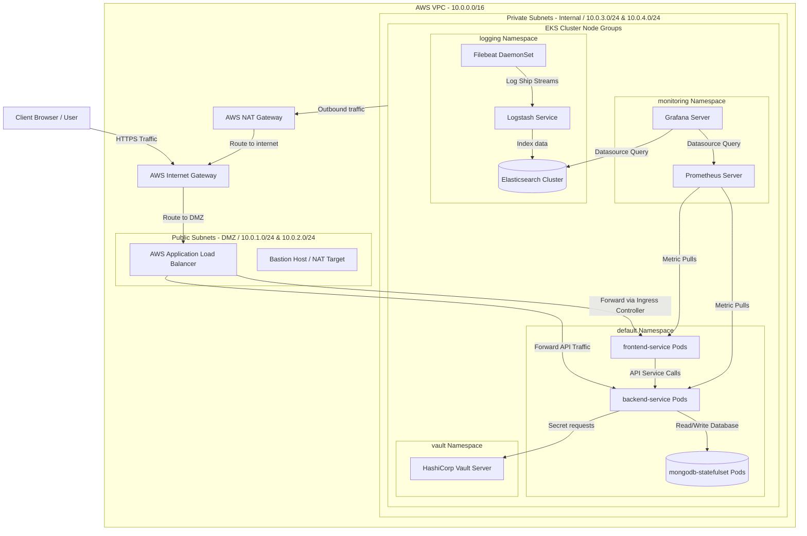

# RetailOps Cloud Deployment Diagram
This document describes the logical deployment topology of the RetailOps platform inside AWS (Amazon Web Services), detailing network isolation, subnets, routing, and deployment boundaries.

---

## 1. Mermaid Deployment Diagram

The diagram below details the AWS VPC configuration, public-private subnet separation, NAT/Internet Gateways, and EKS node distributions.

---

## 2. Infrastructure Explanation

* **AWS VPC (10.0.0.0/16):** An isolated virtual network that contains all cloud resources. It defines a custom IP space and isolates the RetailOps cluster from external threats.
* **Public Subnets:** Act as a DMZ (Demilitarized Zone). Public routing tables connect these subnets directly to the **Internet Gateway (IGW)**. Only public-facing components like the **AWS Application Load Balancer (ALB)** and Bastion hosts are deployed here.
* **Private Subnets:** House the EKS managed node groups. Private subnets do not route traffic directly to the internet. Instead, they route outbound requests (e.g., pulling Docker Hub images or installing OS patches) through a **NAT Gateway (NGW)** located in the public subnets.
* **EKS Managed Node Groups:** Scalable EC2 virtual machines hosting the Kubernetes control plane workers.
* **Stateful Set Persistence:** The MongoDB database utilizes EBS (Elastic Block Store) Volumes attached to EKS nodes to ensure data persists across database pod restarts.
* **Security & Observability Stacks:** Tools like HashiCorp Vault, Prometheus, Grafana, and ELK are deployed locally in their respective namespaces inside the private subnets, ensuring zero public API exposure.

---

## 3. Network Flow Explanation

### Inbound Flow (External Client Access)
1. The **User** inputs the retail site URL. The DNS routes the request to the **AWS Application Load Balancer (ALB)** sitting in the Public Subnets.
2. The ALB receives the request and forwards it through the AWS network to the **Kubernetes Ingress Controller** inside the EKS cluster.
3. The Ingress Controller directs traffic to the `frontend-service` pods.
4. When the user checks out or searches products, the React app makes an API request to `https://api.retailops.com`. The ALB intercepts this and forwards it to the `backend-service` pods.
5. The `backend-service` validates requests, writes to the `mongodb-statefulset` pods, and returns responses to the user.

### Outbound Flow (Security & Updates)
1. To obtain secrets (like connection tokens), the backend queries the local **Vault Service** inside the private subnet. This traffic remains entirely internal.
2. If an EKS node or pod needs external resources (e.g. updating packages or downloading dependency definitions), the request travels to the **NAT Gateway (NGW)** in the Public Subnet, which forwards it to the **Internet Gateway (IGW)** using NAT translation.

### Monitoring & Logging Ingestion
1. **Filebeat** instances collect stdout logs locally on each node and forward them to **Logstash** within the internal cluster subnet. Logstash processes and indexes the entries into **Elasticsearch**.
2. **Prometheus** initiates pull sweeps, fetching metrics from backend pods, frontend endpoints, and host OS nodes.
3. Users/Reviewers connect to **Grafana** (exposed internally or via port-forwarding) to view monitoring panels populated by Prometheus and Elasticsearch.
