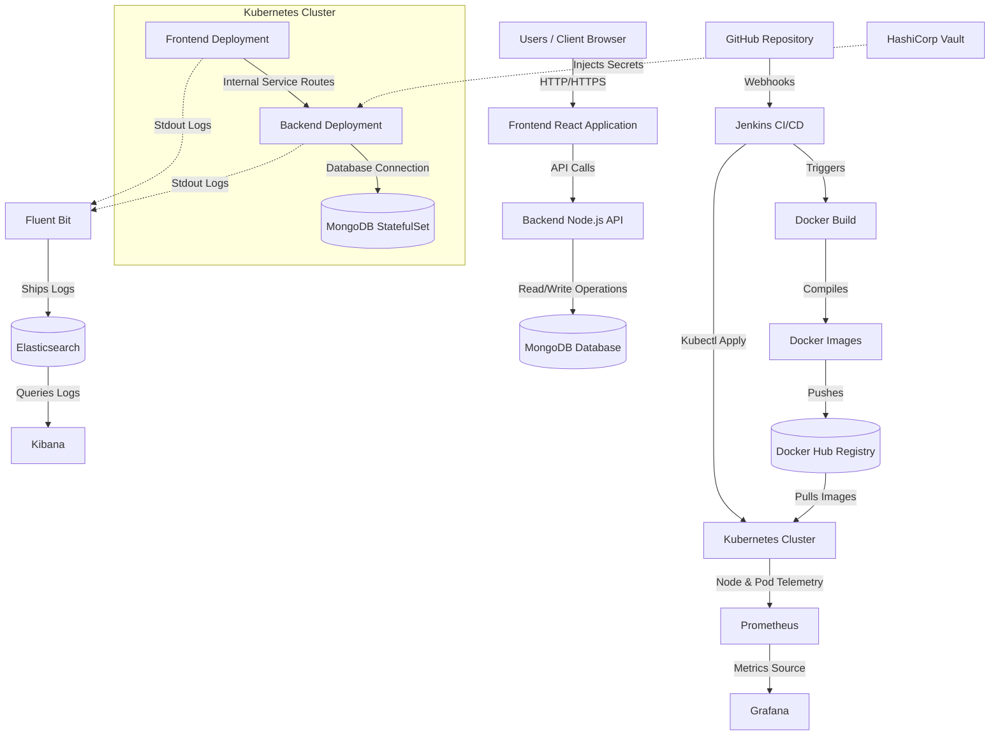

# RetailOps Platform Architecture Diagram
This document describes the high-level system architecture of the RetailOps platform, detailing the relationships between developers, source control, build systems, cloud infrastructure, observability planes, and data storage systems.

---

## 1. Mermaid Architecture Diagram

---

## 2. Component Explanations

* **Users / Client Browser**: Accesses the user interface storefront.
* **Frontend React Application**: Displays the user catalog, handles search requests, and manages the shopping cart.
* **Backend Node.js API**: Handles transactional requests, processes catalog logic, and interfaces with the database.
* **MongoDB Database**: Preserves platform catalog, transaction records, and user profiles.
* **GitHub Repository**: The central version-control repository housing application code and IaC manifests.
* **Jenkins CI/CD**: Runs unit tests, compiles Docker images, runs security checks, pushes to registries, and deploys configurations to Kubernetes.
* **Docker Hub**: Container image repository hosting versions of frontend and backend microservices.
* **Kubernetes Cluster**: Orchestration plane managing the lifecycle, availability, routing, and scaling of application pods.
* **HashiCorp Vault**: Stores and injects credentials, MongoDB connection tokens, and authentication secrets dynamically into pods at runtime.
* **Prometheus & Grafana**: Pulls cluster-level and application-level metrics to render CPU, memory, request volume, and node capacity dashboards.
* **Fluent Bit, Elasticsearch, and Kibana**: Gathers container outputs, transforms logs, indexes records, and enables real-time search queries.
