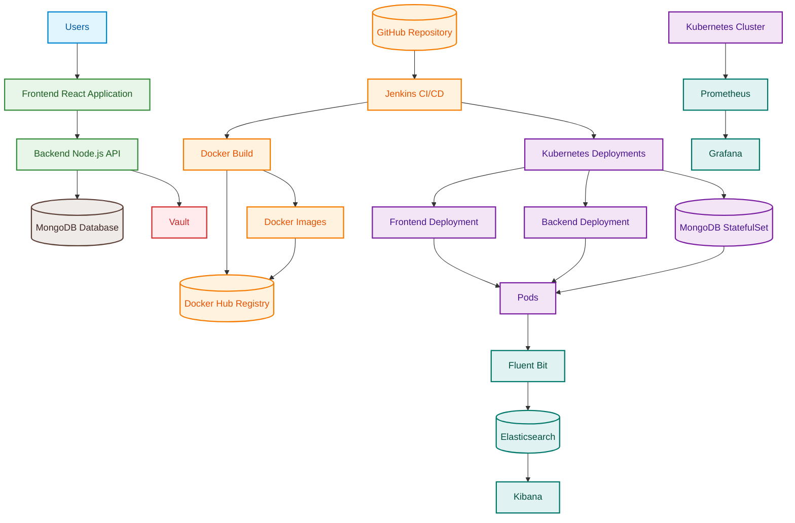

# RetailOps Platform Architecture

This document describes the high-level system architecture of the RetailOps platform, outlining the components and their integration pathways.

## 1. System Architecture Diagram

## 2. Component Explanations

Here is an explanation of each component within the RetailOps platform:

### User & Frontend Layer
* **Users**: Represents the client-side consumers accessing the RetailOps application via web browsers.
* **Frontend React Application**: The client-side application built with React, which presents the user interface and interacts with the backend APIs.

### Application Logic & Data Layer
* **Backend Node.js API**: The server-side API application built with Node.js, implementing business logic, routing, and processing requests.
* **MongoDB Database**: The primary database system storing and managing RetailOps application data.

### Version Control & CI/CD Pipeline
* **GitHub Repository**: The code repository hosting source code, scripts, Kubernetes manifests, and pipeline definitions.
* **Jenkins CI/CD**: The automation server that orchestrates continuous integration and continuous deployment tasks.
* **Docker Build**: The build stage run by Jenkins to package applications into container images.
* **Docker Images**: The built container images representing standardized versions of the frontend and backend applications.
* **Docker Hub Registry**: The remote container registry where compiled Docker images are stored, versioned, and distributed.

### Kubernetes Infrastructure
* **Kubernetes Cluster**: The container orchestration cluster managing workloads and deployments.
* **Kubernetes Deployments**: Controller configurations declaring target pod states and scaling guidelines in Kubernetes.
* **Frontend Deployment**: Specific Kubernetes deployment controller managing the pods for the Frontend React Application.
* **Backend Deployment**: Specific Kubernetes deployment controller managing the pods for the Backend Node.js API.
* **MongoDB StatefulSet**: Kubernetes controller managing the stateful database pods with stable identifiers and persistent volumes.
* **Pods**: The basic running execution units (containers) representing application instances inside Kubernetes.

### Security Plane
* **Vault**: The HashiCorp Vault server used to securely manage, retrieve, and inject secrets (like database credentials and API keys) into the Backend Node.js API.

### Observability (Metrics & Logs) Stack
* **Prometheus**: Monitoring system that scrapes and stores metrics from the Kubernetes Cluster and applications.
* **Grafana**: Dashboard visualization suite that queries Prometheus metrics to display CPU, memory, and custom application metrics.
* **Fluent Bit**: Log processor and forwarder that collects stdout/stderr logs from all Pods in the Kubernetes cluster.
* **Elasticsearch**: Distributed search and analytics engine that indexes and stores logs shipped from Fluent Bit.
* **Kibana**: Interactive visualization dashboard used to search and visualize log data stored in Elasticsearch.
