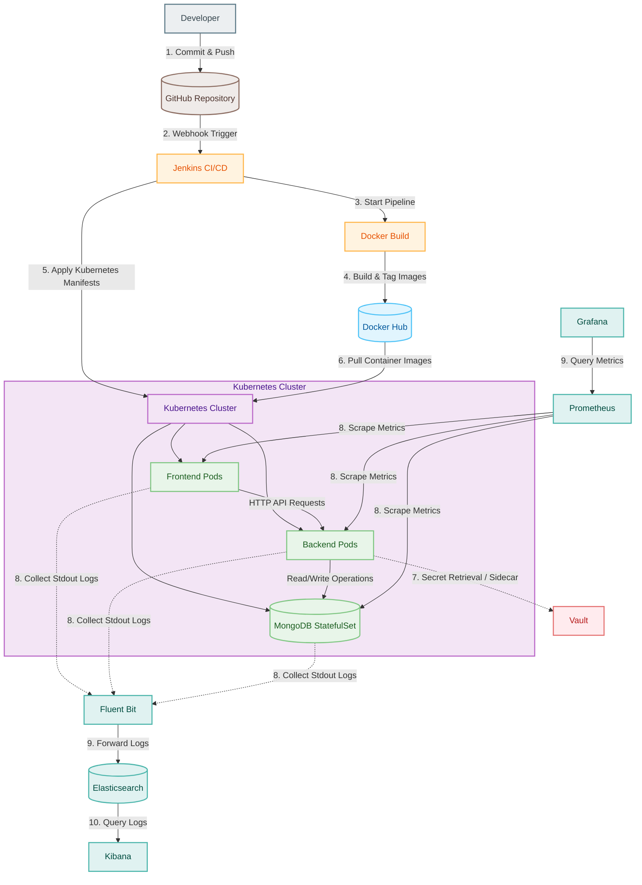

# RetailOps Deployment Architecture

This document describes the logical deployment topology and the end-to-end CI/CD lifecycle of the RetailOps platform.

## 1. System Deployment & CI/CD Flow Diagram

The diagram below details the entire pipeline from code commit by developers to image building, container registry storage, Kubernetes deployment orchestration, and runtime observability/security configurations.

---

## 2. CI/CD Lifecycle & Deployment Process

The deployment process follows a fully automated git-ops inspired workflow:

### Step 1: Code Integration
1. The **Developer** pushes code commits or infrastructure changes (Kubernetes manifests, Helm scripts, Terraform code) to the central **GitHub** repository.
2. GitHub fires a repository webhook to notify **Jenkins** of the new code changes.

### Step 2: Build & Package
3. **Jenkins** triggers a build agent that runs unit tests, static code analysis, and the **Docker Build** stage.
4. The **Docker Build** compiles the frontend React code and backend Node.js code, packages them into optimized multi-stage Docker images, and pushes them to **Docker Hub**.

### Step 3: Orchestration & Placement
5. **Jenkins** connects to the **Kubernetes** API server using the cluster credentials (e.g., via `kubectl`) and applies the updated manifests.
6. The **Kubernetes Cluster** pulls the corresponding newly built container images from **Docker Hub** to schedule and run the updated application pods:
   - **Frontend Pods**: Serving the React UI storefront.
   - **Backend Pods**: Hosting the Node.js API services.
   - **MongoDB StatefulSet**: Maintaining the stateful database nodes.

---

## 3. Operational Infrastructure

### Security (Secret Management)
* **Vault**: When the Backend Pods start up, they query the **Vault** instance to retrieve sensitive environment variables (such as MongoDB connection strings and JWT secrets), avoiding storing sensitive information in plaintext configs.

### Observability & Monitoring
* **Fluent Bit**: A lightweight log daemon running on cluster nodes. It collects stdout/stderr logs from the **Frontend Pods**, **Backend Pods**, and **MongoDB StatefulSet** and ships them to **Elasticsearch**.
* **Elasticsearch & Kibana**: Elasticsearch indexes and stores logs chronologically, enabling real-time analytics and querying via the **Kibana** interface.
* **Prometheus**: Scrapes resource usage (CPU, Memory, Request Counts) directly from active pods.
* **Grafana**: Pulls telemetry from Prometheus to populate performance monitoring dashboards.
