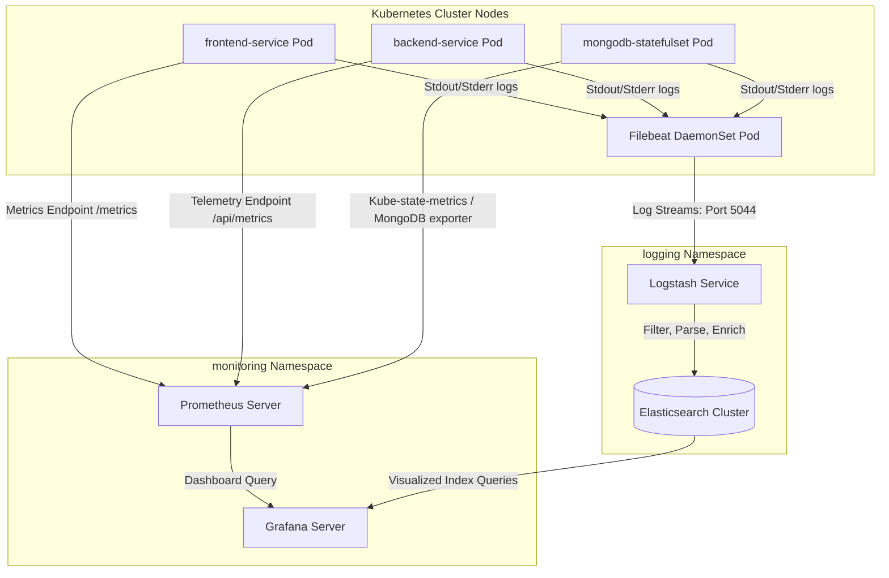

# RetailOps Observability & Monitoring Report
This report provides a detailed overview of the monitoring and logging infrastructure implemented for the RetailOps platform. Designed for evaluation/academic demonstrations, it details how the Prometheus-Grafana stack and the ELK (Elasticsearch, Logstash, Filebeat) stack integrate to provide complete centralized visibility.

---

## 1. Architecture Overview

The monitoring and logging design utilizes a decentralized collection, centralized parsing, and unified visualization architecture standard in modern cloud-native environments.

### Flow Explanations
1. **Metrics Pipeline (Pull Model):**
   * Microservices (`frontend-service`, `backend-service`, and infrastructure databases) expose telemetry metrics endpoints.
   * **Prometheus** periodically pulls (scrapes) these metrics.
   * **Grafana** queries Prometheus data sources to display system resource metrics, request volumes, latency, and application state dynamically.
2. **Logging Pipeline (Push Model):**
   * Applications write logs to standard output/standard error (`stdout`/`stderr`), which Kubernetes stores as host files in `/var/log/containers/*.log`.
   * **Filebeat** runs on each node, reads these container log files, enriches them with Kubernetes-specific metadata, and streams them to **Logstash**.
   * **Logstash** acts as the ingestion parser, matching JSON/Nginx logs with filters (`grok`, `json`, etc.) before passing the structured documents to **Elasticsearch** for storage.
   * Reviewers and developers query Elasticsearch through visualization engines.

---

## 2. How Prometheus Works

Prometheus is a time-series database and monitoring server that relies on a **pull-based** collection mechanism.

### Key Working Principles
* **Scrape Configuration:** Configured in `prometheus-config.yaml`, it defines `scrape_configs` (jobs) listing HTTP endpoints to target.
* **Service Discovery:** Prometheus queries the Kubernetes API Server dynamically to locate pods/services labeled for monitoring rather than hardcoding IP addresses.
* **Data Retrieval:** Prometheus executes HTTP GET requests on the metrics endpoints (e.g., `/api/metrics`) at defined intervals (e.g., 15s).
* **Data Model:** Telemetry is stored as time-series data: numeric values timestamped at the millisecond level, classified by name and key-value label pairs.
* **PromQL:** An expression language enabling developers to aggregate and filter metrics dynamically (e.g., calculating the 95th percentile latency or calculating request rates over 5-minute windows).

---

## 3. How Grafana Works

Grafana is an open-source analytics and visualization platform that connects to data sources like Prometheus and Elasticsearch.

### Key Working Principles
* **Data Sources Connection:** Grafana queries other databases. A data source is registered (e.g., a Prometheus datasource mapping to the `http://prometheus:9090` service IP).
* **Panels & Dashboards:** The dashboard (`grafana-dashboard.json`) aggregates individual panels. Each panel is defined by a query written in the data source's native language (like PromQL).
* **Variables & Templating:** Dashboards are parameterized (e.g., dynamically selecting namespaces, nodes, or pods to filter dashboards without editing individual queries).
* **Alerting Engine:** Grafana evaluates queries against thresholds (e.g., "CPU usage > 85% for 5 minutes") and fires notifications to Slack, PagerDuty, or Webhooks.

---

## 4. How Filebeat Works

Filebeat is a lightweight agent installed as a **DaemonSet** (one agent pod per physical/virtual Kubernetes node) designed to forward and centralize log files.

### Key Working Principles
* **Low Overhead:** Written in Go, Filebeat consumes minimal CPU and memory compared to heavier JVM-based collection agents.
* **Harvesters and Inputs:** Filebeat inputs scan specified paths (`/var/log/containers/*.log` on the Kubernetes hosts). A harvester is spawned per log file to read new lines in real-time.
* **Registry File:** Keeps track of the exact byte offset read in each log file. If the Filebeat pod restarts, it resumes reading from where it left off, preventing log duplication or loss.
* **Backpressure Management:** Filebeat monitors output throughput. If Logstash or Elasticsearch slows down, Filebeat slows its reading rate to prevent network and buffer congestion.

---

## 5. How Logstash Works

Logstash is an event processing pipeline engine that ingests data, transforms/normalizes it, and sends it to a storage backend.

### Key Working Principles
* **Pipeline Structure:** Composed of three stages: **Inputs** -> **Filters** -> **Outputs**.
* **Inputs:** Logstash opens server sockets (e.g., Beats port 5044) to accept incoming connections from shippers like Filebeat.
* **Filters:**
  * **grok:** Matches unstructured log lines against predefined regular expressions to extract structured fields (e.g., extracting IP, status, HTTP methods from Nginx logs).
  * **json:** Parses JSON strings (e.g., structured application logs) into dedicated indexable fields.
  * **mutate:** Renames, converts, combines, or strips fields to standardize schema properties.
  * **date:** Parses string timestamps and overwrites the event's default ingestion time (`@timestamp`) for chronological accuracy.
* **Outputs:** Routes the final structured document to targets, primarily Elasticsearch clusters, while logging raw events to standard output (`stdout`) for debugging.

---

## 6. How Centralized Monitoring Satisfies the RetailOne Project Statement

Implementing centralized observability satisfies key design criteria of the RetailOne/RetailOps DevOps statement:

* **Production Readiness:** Centralized observability moves operations from a reactive state to a proactive state. Instead of SSH-ing into individual pods to run `kubectl logs` (which is insecure and volatile), administrators analyze global dashboards.
* **Resource Cost Optimization:** Analyzing CPU and Memory trends over time helps developers optimize resource requests/limits in Kubernetes manifests, ensuring HPAs trigger efficiently.
* **Root Cause Analysis (RCA):** By correlating metric spikes (e.g., 500 status codes in Grafana) with timestamp-matched error logs in Elasticsearch, engineers debug production outages in seconds rather than hours.
* **Ephemeral Container Log Management:** Kubernetes pods are highly transient. When a pod crashes or is rescheduled, its local container logs are destroyed. Filebeat instantly ships logs off-node, securing historical transaction data for audit and analysis.

---

## 7. Reviewer-Facing Explanation Script

Use this script during your evaluation/presentation to walk reviewers through your observability implementation:

> **Student Script:**
>
> "Hello. Today, I'll walk you through the Monitoring and Logging infrastructure implemented for the RetailOps platform.
>
> First, let's look at the **monitoring directory**. Under `monitoring/prometheus-config.yaml`, I have configured a Prometheus ConfigMap. It contains the scraping configurations for our environment. You will see it defines five distinct jobs:
> 1. A self-monitoring job for Prometheus.
> 2. A Kubernetes API Server discovery job.
> 3. A Kubernetes Node resource collection job.
> 4. A specific job targeting our backend Node.js microservice (`backend-service`) on `/api/metrics`.
> 5. A job targeting our Nginx frontend web server (`frontend-service`) on `/metrics`.
>
> Next, I configured a comprehensive Grafana Dashboard in `monitoring/grafana-dashboard.json`. The dashboard is titled **'RetailOps Platform Monitoring'** and contains custom-built timeseries and gauge panels that map to the golden signals of SRE. It includes panels for:
> * **CPU Usage (per pod)** - to track resource depletion.
> * **Memory Usage (per pod)** - to monitor memory leaks.
> * **Request Rate (RPS)** - showing transaction volume.
> * **Error Rate** - tracking HTTP 5xx responses using rate metrics.
> * **API Latency (p95)** - showing the latency boundary for 95% of users.
> * **Pod Health** - a gauge indicating the active count of healthy replicas inside our cluster.
>
> Now, moving to the **logging directory**, we have the log consolidation setup:
> * In `logging/filebeat-daemonset.yaml`, I defined a lightweight Kubernetes DaemonSet. This runs an agent on every node, mounts the host directory `/var/log/containers`, attaches Kubernetes metadata to the logs, and forwards them to our processing pipeline.
> * In `logging/logstash-config.conf`, I defined the processing pipeline. It listens for Filebeat streams on port 5044, uses `json` filters to parse our backend's application logs, uses `grok` patterns to parse the frontend Nginx access logs into structured fields, and indexes them into Elasticsearch under daily indices prefixed with `retailops-`.
>
> This centralized system guarantees that logs persist even if a container crashes, and it gives us absolute, single-pane-of-glass visibility into both application performance and infrastructure health."

---

## 8. List of Screenshots Reviewers Should Take

If deploying this setup, include these screenshots in your final report to verify your implementation:

1. **Kubernetes Observability Status:**
   * Run: `kubectl get pods -n monitoring && kubectl get pods -n logging`
   * *Screenshot showing Prometheus, Grafana, Filebeat (DaemonSet replicas), and Logstash pods in `Running` state.*
2. **Prometheus Targets Page:**
   * Port-forward Prometheus: `kubectl port-forward svc/prometheus-service 9090:9090 -n monitoring`
   * Navigate to `http://localhost:9090/targets`
   * *Screenshot showing `backend-service` and `frontend-service` endpoints listed as 'UP' and green.*
3. **Grafana RetailOps Dashboard:**
   * Port-forward Grafana: `kubectl port-forward svc/grafana-service 3000:3000 -n monitoring`
   * Access `http://localhost:3000` and open the 'RetailOps Platform Monitoring' dashboard.
   * *Screenshot showing active graphs representing CPU, Memory, Request rate, and a green Gauge for Pod Health.*
4. **Elasticsearch Index Patterns (Kibana/Grafana Log Viewer):**
   * *Screenshot showing indices matching `retailops-default-*` successfully created in Elasticsearch, with log entries showing parsed fields such as `client_ip`, `status_code`, and `api_route`.*
