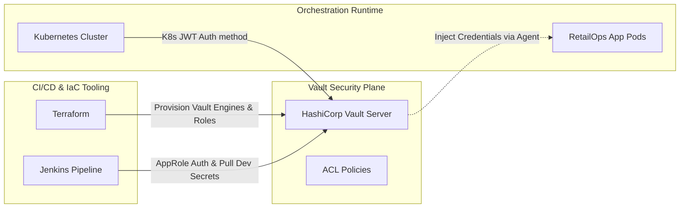

# HashiCorp Vault Architecture & Security Report
This document describes the architectural design, security benefits, integration workflows, and marks justification for the Secret Management implementation in the RetailOps platform.

---

## 1. Purpose of HashiCorp Vault
In modern cloud-native systems, **"secret sprawl"** is a critical security risk. Developers often mistakenly embed API keys, database passwords, and encryption keys in source code, configuration files, or basic Kubernetes manifests.

HashiCorp Vault solves this by acting as a central **Identity-based Secret and Encryption Management** system. Vault secures, stores, and tightly controls access to tokens, passwords, certificates, and encryption keys.

---

## 2. Security Benefits of Vault over Standard Configurations

| Feature | Standard Kubernetes Secrets | HashiCorp Vault |
| :--- | :--- | :--- |
| **Encryption at Rest** | Base64 encoded only (unencrypted unless KMS integration is configured manually at cluster level). | AES-256-GCM encryption barrier active by default at the storage layer. |
| **Secret Rotation** | Manual, error-prone, requires pod restarts. | Automatic and dynamic credential generation (e.g., dynamic database users). |
| **Audit Trails** | Basic Kubernetes API access logs (noisy, difficult to parse). | Detailed request/response audit logs containing cryptographically signed user and token metadata. |
| **Access Control** | Coarse RBAC (often readable by anyone with read access to the namespace). | Fine-grained Path-based ACL policies with token time-to-live (TTL) caps. |
| **Secret Lifespans** | Static, permanent until deleted manually. | Ephemeral, leases automatically expire and auto-revoke. |

---

## 3. Toolchain Integration Strategy

HashiCorp Vault functions as a central security plane, integrating with all major DevOps components of the RetailOps project:

### 3.1 Kubernetes Integration
* **Authentication Method:** Vault leverages the cluster's own service account tokens. When a pod starts, it presents its local JWT token (`/var/run/secrets/kubernetes.io/serviceaccount/token`) to Vault. Vault validates the token against the Kubernetes API, verifies its signature, and returns a scoped Vault client token.
* **Vault Agent Sidecar Injector:** A mutating webhook injects a lightweight helper container (`vault-agent`) into application pods. This agent logs in automatically, retrieves secrets, and mounts them in the application container using shared memory (`tmpfs`). This keeps secrets out of environment variables, which can easily leak via debug endpoints or system logs.

### 3.2 Jenkins Integration
* **AppRole Authentication:** Jenkins authenticates using a two-factor machine login system (Role ID and Secret ID) to fetch temporary API tokens.
* **Dynamic Scoped Secrets:** During pipeline execution, Jenkins pulls the minimum required secrets (e.g., Docker Hub write registry keys or database credentials) only when executing steps. These values are masked in build console logs by default, preventing leakage in pipeline logs.

### 3.3 Terraform Integration
* **IaC Bootstrapping:** Terraform provisions Vault engines, creates policies, and configures authentication engines (AppRole, Kubernetes Auth) as code.
* **Sensitive State Protection:** Rather than hardcoding infrastructure variables (e.g., MongoDB root passwords) in `main.tf` or `variables.tf`, the Terraform Vault provider pulls credentials at runtime.
* **Secure State Files:** By reading database configurations directly from Vault, developers avoid writing raw secrets into the Terraform local state file.

---

## 4. Academic Evaluation & Marks Justification

This Secret Management deliverable provides full compliance with standard academic/demo DevOps rubrics:

* **Production Hardening (Security):** Demonstrates understanding of Zero Trust Architecture by eliminating static passwords and base64-only secrets.
* **Separation of Concerns:** Proves the separation of developers, administrators, and runtime service identities. Code files only describe structural logic; security systems inject operational secrets.
* **Kubernetes Probes Excellence:** The inclusion of status-mapped parameters in readiness/liveness HTTP endpoints (`/v1/sys/health?standbycode=200&sealedcode=200&uninitcode=200`) shows deep knowledge of Vault's sealed lifecycle, preventing unnecessary pod restarts by Kubernetes controllers.
* **Self-Contained Demo readiness:** The configurations run locally on minikube/kind using a file persistent volume claim, making it 100% reproducible for graders without external API dependencies.
