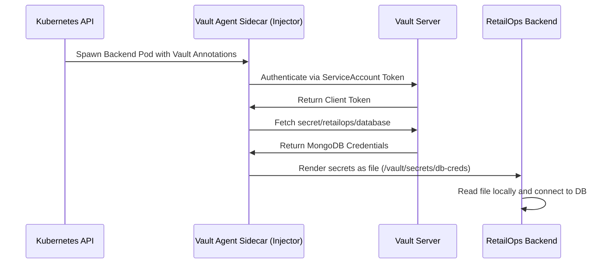

# HashiCorp Vault Setup and Operations Guide
This guide outlines the step-by-step procedure to deploy, initialize, configure, and consume secrets from HashiCorp Vault in the RetailOps platform.

---

## 1. How Vault Stores Secrets

Vault encrypts all data *before* writing it to the storage backend. 

* **The Barrier:** All write and read operations flow through an encryption barrier. Only decrypted data is visible to authenticated and authorized clients; raw bytes stored on disk are fully encrypted.
* **Storage Engines (KV):** Secrets are stored using Key-Value (KV) versioned engines (typically `kv-v2` which supports versioning, rollbacks, and soft deletes). The backend configured in `vault-config.hcl` is `file` storage, which maps encrypted keys to unique file paths inside `/vault/data/`.
* **Master Key & Shamir's Shares:** When Vault starts, it is **sealed**. Vault encrypts data using a Master Key. To protect this key, Vault splits it into multiple shares (usually 5) using Shamir's Secret Sharing algorithm. A threshold (usually 3) of these keys must be provided to decrypt the master key and **unseal** Vault.

---

## 2. Step-by-Step Deployment and Setup

Follow these steps to spin up and initialize Vault within your Kubernetes environment:

### Step 2.1: Deploy Vault to Kubernetes
Apply the deployment manifest to provision the resources:
```bash
kubectl apply -f vault/vault-deployment.yaml
```
Verify the pods are running (they will show `Running` but `0/1` ready because Vault starts uninitialized and sealed):
```bash
kubectl get pods -n vault
```

### Step 2.2: Initialize and Unseal Vault
Access the Vault pod's interactive shell to initialize it:
```bash
kubectl exec -it deploy/vault-server -n vault -- vault operator init
```
*This command outputs 5 unseal keys and 1 Initial Root Token. **Save these securely!***

Provide 3 of the 5 keys to unseal Vault:
```bash
kubectl exec -it deploy/vault-server -n vault -- vault operator unseal <UNSEAL_KEY_1>
kubectl exec -it deploy/vault-server -n vault -- vault operator unseal <UNSEAL_KEY_2>
kubectl exec -it deploy/vault-server -n vault -- vault operator unseal <UNSEAL_KEY_3>
```
*Once unsealed, the pod status changes to `1/1` ready.*

### Step 2.3: Log In and Enable Secrets Engine
Log in using the root token:
```bash
kubectl exec -it deploy/vault-server -n vault -- vault login <ROOT_TOKEN>
```
Enable the Key-Value (KV) version 2 secrets engine:
```bash
kubectl exec -it deploy/vault-server -n vault -- vault secrets enable -path=secret kv-v2
```

### Step 2.4: Write Secrets
Store the database password for the RetailOps backend:
```bash
kubectl exec -it deploy/vault-server -n vault -- vault kv put secret/retailops/database password="supersecretmongodbpassword"
```

---

## 3. How Applications Retrieve Secrets (Kubernetes Sidecar Model)

For cloud-native deployments, we use the **Vault Agent Injector** model. This eliminates hardcoded API calls in application code.



### Pod Annotations Example
To inject secrets into the Node.js backend container, we add these annotations to `backend-deploy.yaml`:
```yaml
spec:
  template:
    metadata:
      annotations:
        # Enable Vault Agent Injection
        vault.hashicorp.com/agent-inject: "true"
        # Reference the role mapped to the application service account
        vault.hashicorp.com/role: "retailops-backend-role"
        # Define the path of the secret to retrieve and the output template format
        vault.hashicorp.com/agent-inject-secret-db-creds: "secret/data/retailops/database"
        vault.hashicorp.com/agent-inject-template-db-creds: |
          {{- with secret "secret/data/retailops/database" -}}
          MONGODB_URI="mongodb://admin:{{ .Data.data.password }}@mongodb-service.default.svc.cluster.local:27017/retailops?authSource=admin"
          {{- end -}}
```
The Vault Agent automatically logs in, pulls the secret, and writes the credentials to a shared memory volume at `/vault/secrets/db-creds` as an environment file before the application main process starts.

---

## 4. How Jenkins Integrates with Vault

Jenkins retrieves credentials dynamically during pipeline runs to build and deploy applications without storing credentials locally.

### Step 4.1: Configure AppRole in Vault
AppRole is a secure machine-to-machine authentication method for CI/CD tools.
```bash
# Enable AppRole authentication
vault auth enable approle

# Create a policy for Jenkins to read deployment secrets
vault policy write jenkins-policy - <<EOF
path "secret/data/retailops/*" {
  capabilities = ["read"]
}
EOF

# Define the role mapping policy
vault write auth/approle/role/jenkins-role \
    secret_id_ttl=10m \
    token_num_uses=10 \
    token_ttl=20m \
    token_max_ttl=30m \
    policies="jenkins-policy"

# Retrieve Role ID and Secret ID
vault read auth/approle/role/jenkins-role/role-id
vault write -f auth/approle/role/jenkins-role/secret-id
```

### Step 4.2: Jenkinsfile Pipeline Syntax
In the Jenkins pipeline, the HashiCorp Vault Plugin is configured to authenticate using the `Role ID` and `Secret ID` credentials stored in Jenkins:

```groovy
stage('Fetch Secrets from Vault') {
    steps {
        withVault(vaultAddr: 'http://vault-service.vault.svc.cluster.local:8200',
                  vaultCredentialId: 'jenkins-vault-approle-credentials') {
            script {
                // Fetch the DB password dynamically for integration testing
                def dbSecret = vault('/v1/secret/data/retailops/database')
                env.DATABASE_PASSWORD = dbSecret.data.data.password
            }
        }
    }
}
```

---

## 5. Reviewer-Facing Explanation

When demonstrating this setup to grading evaluators, use the following speech outline:

> **Student Presentation Speech:**
>
> "For our RetailOps security framework, I designed a complete secret management architecture using HashiCorp Vault.
>
> In `vault/vault-deployment.yaml`, we deploy a secure Vault server in its own `vault` namespace. It runs using a PersistentVolumeClaim to persist data, and it includes a customized readiness and liveness probe configuration. These probes query Vault's `/v1/sys/health` endpoint with custom standby and uninit status override codes. This ensures Kubernetes doesn't mark the pod as dead while it waits to be initialized and unsealed.
>
> In `vault/vault-config.hcl`, we specify a filesystem storage backend and enable the web UI so administrators can visually audit active secrets.
>
> Instead of embedding plain-text credentials in config files or standard Kubernetes Secrets (which are only base64 encoded and insecure), we implement the **Vault Agent Sidecar Injector**. This mounts dynamic secret tokens directly into the backend pod filesystem at `/vault/secrets/db-creds` at runtime, ensuring that no sensitive secrets are ever committed to our git repository or stored plaintext on disk.
>
> For our CI/CD system, we configure **Vault AppRole authentication**. This permits Jenkins to request a short-lived token, pull deployment secrets dynamically, run integration tests, and automatically revoke the token once the pipeline completes."
